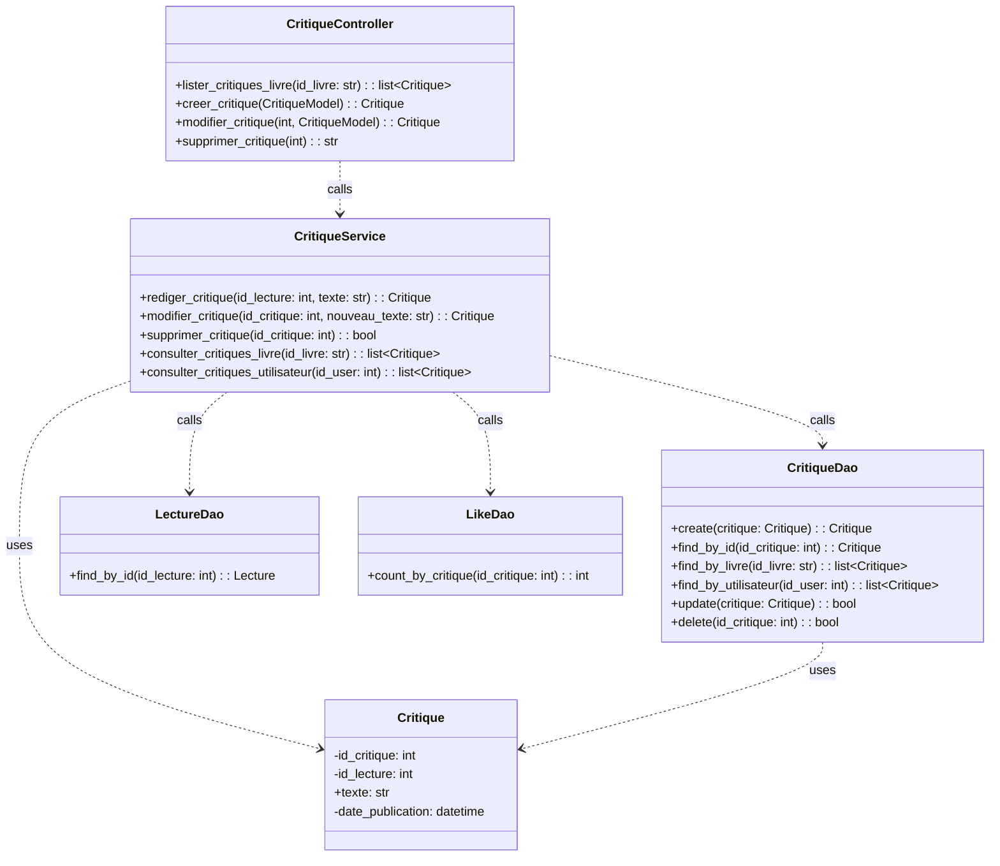

```mermaid
classDiagram
    %% Business object
    class Critique {
        -id_critique: int
        -id_lecture: int
        +texte: str
        -date_publication: datetime
    }

    %% Data Access Object
    class CritiqueDao {
        +create(critique: Critique): Critique
        +find_by_id(id_critique: int): Critique
        +find_by_livre(id_livre: str): list~Critique~
        +find_by_utilisateur(id_user: int): list~Critique~
        +update(critique: Critique): bool
        +delete(id_critique: int): bool
    }

    %% DAO externes dont dépend le Service (autres objets métier)
    class LectureDao {
        +find_by_id(id_lecture: int): Lecture
    }

    class LikeDao {
        +count_by_critique(id_critique: int): int
    }

    %% Service layer
    class CritiqueService {
        +rediger_critique(id_lecture: int, texte: str): Critique
        +modifier_critique(id_critique: int, nouveau_texte: str): Critique
        +supprimer_critique(id_critique: int): bool
        +consulter_critiques_livre(id_livre: str): list~Critique~
        +consulter_critiques_utilisateur(id_user: int): list~Critique~
    }

    %% Controller
    class CritiqueController {
        +lister_critiques_livre(id_livre: str): list~Critique~
        +creer_critique(CritiqueModel): Critique
        +modifier_critique(int, CritiqueModel): Critique
        +supprimer_critique(int): str
    }

    %% Relationships
    CritiqueService ..> CritiqueDao : calls
    CritiqueService ..> LectureDao : calls
    CritiqueService ..> LikeDao : calls
    CritiqueService ..> Critique : uses
    CritiqueDao ..> Critique : uses
    CritiqueController ..> CritiqueService : calls
```