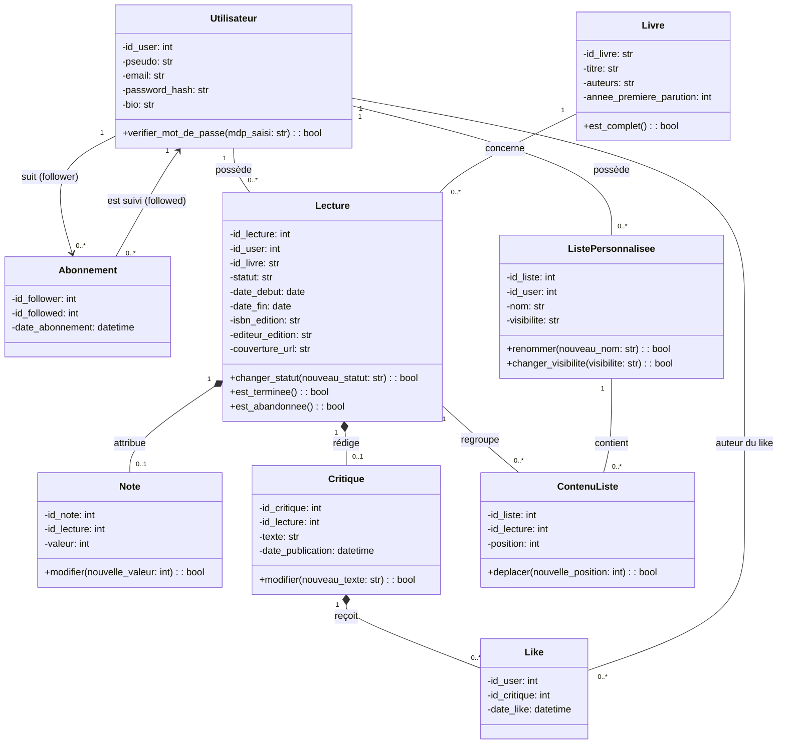

```mermaid
classDiagram
    class Utilisateur {
        -id_user: int
        -pseudo: str
        -email: str
        -password_hash: str
        -bio: str
         
        +verifier_mot_de_passe(mdp_saisi: str): bool
    }

    class Livre {
        -id_livre: str
        -titre: str
        -auteurs: str
        -annee_premiere_parution: int
         
        +est_complet(): bool
    }

    class Abonnement {
        -id_follower: int
        -id_followed: int
        -date_abonnement: datetime 
        
    }

    class Lecture {
        -id_lecture: int
        -id_user: int
        -id_livre: str
        -statut: str
        -date_debut: date
        -date_fin: date
        -isbn_edition: str
        -editeur_edition: str
        -couverture_url: str
         
        +changer_statut(nouveau_statut: str): bool
        +est_terminee(): bool
        +est_abandonnee(): bool
    }

    class ListePersonnalisee {
        -id_liste: int
        -id_user: int
        -nom: str
        -visibilite: str
         
        +renommer(nouveau_nom: str): bool
        +changer_visibilite(visibilite: str): bool
    }

    class Note {
        -id_note: int
        -id_lecture: int
        -valeur: int
         
        +modifier(nouvelle_valeur: int): bool
    }

    class Critique {
        -id_critique: int
        -id_lecture: int
        -texte: str
        -date_publication: datetime
         
        +modifier(nouveau_texte: str): bool
    }

    class Like {
        -id_user: int
        -id_critique: int
        -date_like: datetime
    }

    class ContenuListe {
        -id_liste: int
        -id_lecture: int
        -position: int
         
        +deplacer(nouvelle_position: int): bool
    }

    Utilisateur "1" --> "0..*" Abonnement : suit (follower)
    Utilisateur "1" <-- "0..*" Abonnement : est suivi (followed)
    Utilisateur "1" -- "0..*" Lecture : possède
    Livre "1" -- "0..*" Lecture : concerne
    Lecture "1" *-- "0..1" Note : attribue
    Lecture "1" *-- "0..1" Critique : rédige
    Critique "1" *-- "0..*" Like : reçoit
    Utilisateur "1" -- "0..*" Like : auteur du like
    Utilisateur "1" -- "0..*" ListePersonnalisee : possède
    Lecture "1" -- "0..*" ContenuListe : regroupe
    ListePersonnalisee "1" -- "0..*" ContenuListe : contient
```