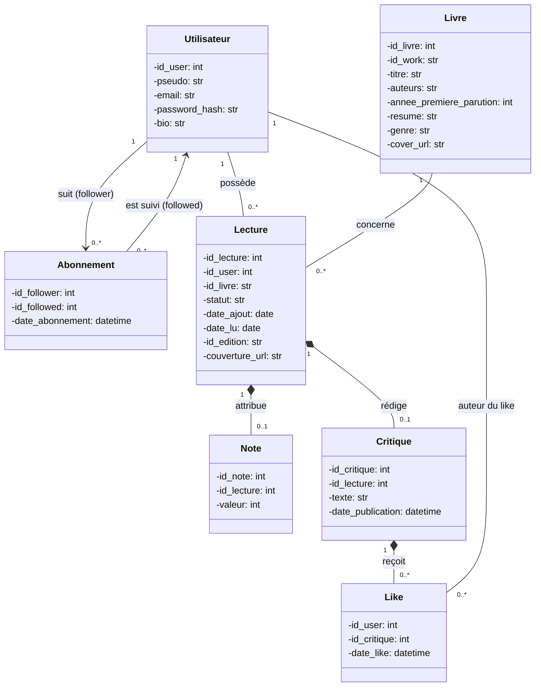

```mermaid
classDiagram
    class Utilisateur {
        -id_user: int
        -pseudo: str
        -email: str
        -password_hash: str
        -bio: str
         

    }

    class Livre {
        -id_livre: int
        -id_work: str
        -titre: str
        -auteurs: str
        -annee_premiere_parution: int
        -resume: str
        -genre: str
        -cover_url: str      

    }

    class Abonnement {
        -id_follower: int
        -id_followed: int
        -date_abonnement: datetime   
    }

    class Lecture {
        -id_lecture: int
        -id_user: int
        -id_livre: str
        -statut: str
        -date_ajout: date
        -date_lu: date
        -id_edition: str
        -couverture_url: str    
    }


    class Note {
        -id_note: int
        -id_lecture: int
        -valeur: int
    }

    class Critique {
        -id_critique: int
        -id_lecture: int
        -texte: str
        -date_publication: datetime
    }

    class Like {
        -id_user: int
        -id_critique: int
        -date_like: datetime
    }


    Utilisateur "1" --> "0..*" Abonnement : suit (follower)
    Utilisateur "1" <-- "0..*" Abonnement : est suivi (followed)
    Utilisateur "1" -- "0..*" Lecture : possède
    Livre "1" -- "0..*" Lecture : concerne
    Lecture "1" *-- "0..1" Note : attribue
    Lecture "1" *-- "0..1" Critique : rédige
    Critique "1" *-- "0..*" Like : reçoit
    Utilisateur "1" -- "0..*" Like : auteur du like

```
