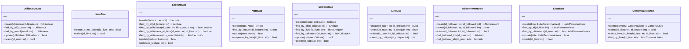

```mermaid
classDiagram
    class UtilisateurDao {
        ----
        +create(utilisateur: Utilisateur): Utilisateur
        +find_by_id(id_user: int): Utilisateur
        +find_by_email(email: str): Utilisateur
        +update(utilisateur: Utilisateur): bool
        +delete(id_user: int): bool
    }

    class LivreDao {
        ----
        +create_if_not_exists(id_livre: str): bool
        +exists(id_livre: str): bool
    }

    class LectureDao {
        ----
        +create(lecture: Lecture): Lecture
        +find_by_id(id_lecture: int): Lecture
        +find_by_utilisateur(id_user: int, filtre_statut: str): list~Lecture~
        +find_by_utilisateur_et_livre(id_user: int, id_livre: str): Lecture
        +find_by_utilisateurs(ids_user: list~int~): list~Lecture~
        +update(lecture: Lecture): bool
        +delete(id_lecture: int): bool
    }

    class NoteDao {
        ----
        +create(note: Note): Note
        +find_by_lecture(id_lecture: int): Note
        +update(note: Note): bool
        +moyenne_by_livre(id_livre: str): float
    }

    class CritiqueDao {
        ----
        +create(critique: Critique): Critique
        +find_by_id(id_critique: int): Critique
        +find_by_livre(id_livre: str): list~Critique~
        +find_by_utilisateur(id_user: int): list~Critique~
        +update(critique: Critique): bool
        +delete(id_critique: int): bool
    }

    class LikeDao {
        ----
        +create(id_user: int, id_critique: int): Like
        +delete(id_user: int, id_critique: int): bool
        +exists(id_user: int, id_critique: int): bool
        +count_by_critique(id_critique: int): int
    }

    class AbonnementDao {
        ----
        +create(id_follower: int, id_followed: int): Abonnement
        +delete(id_follower: int, id_followed: int): bool
        +exists(id_follower: int, id_followed: int): bool
        +find_followed_ids(id_user: int): list~int~
        +find_follower_ids(id_user: int): list~int~
    }

    class ListeDao {
        ----
        +create(liste: ListePersonnalisee): ListePersonnalisee
        +find_by_id(id_liste: int): ListePersonnalisee
        +find_by_utilisateur(id_user: int): list~ListePersonnalisee~
        +update(liste: ListePersonnalisee): bool
        +delete(id_liste: int): bool
    }

    class ContenuListeDao {
        ----
        +create(contenu: ContenuListe): ContenuListe
        +delete(id_liste: int, id_lecture: int): bool
        +exists_livre_in_liste(id_liste: int, id_livre: str): bool
        +find_by_liste(id_liste: int): list~ContenuListe~
    }
```