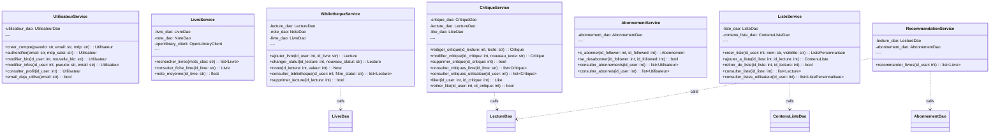

```mermaid
classDiagram
    class UtilisateurService {
        -utilisateur_dao: UtilisateurDao
        ----
        +creer_compte(pseudo: str, email: str, mdp: str): Utilisateur
        +authentifier(email: str, mdp_saisi: str): Utilisateur
        +modifier_bio(id_user: int, nouvelle_bio: str): Utilisateur
        +modifier_infos(id_user: int, pseudo: str, email: str): Utilisateur
        +consulter_profil(id_user: int): Utilisateur
        +email_deja_utilise(email: str): bool
    }

    class LivreService {
        -livre_dao: LivreDao
        -note_dao: NoteDao
        -openlibrary_client: OpenLibraryClient
        ----
        +rechercher_livres(mots_cles: str): list~Livre~
        +consulter_fiche_livre(id_livre: str): Livre
        +note_moyenne(id_livre: str): float
    }

    class BibliothequeService {
        -lecture_dao: LectureDao
        -note_dao: NoteDao
        -livre_dao: LivreDao
        ----
        +ajouter_livre(id_user: int, id_livre: str): Lecture
        +changer_statut(id_lecture: int, nouveau_statut: str): Lecture
        +noter(id_lecture: int, valeur: int): Note
        +consulter_bibliotheque(id_user: int, filtre_statut: str): list~Lecture~
        +supprimer_lecture(id_lecture: int): bool
    }

    class CritiqueService {
        -critique_dao: CritiqueDao
        -lecture_dao: LectureDao
        -like_dao: LikeDao
        ----
        +rediger_critique(id_lecture: int, texte: str): Critique
        +modifier_critique(id_critique: int, nouveau_texte: str): Critique
        +supprimer_critique(id_critique: int): bool
        +consulter_critiques_livre(id_livre: str): list~Critique~
        +consulter_critiques_utilisateur(id_user: int): list~Critique~
        +liker(id_user: int, id_critique: int): Like
        +retirer_like(id_user: int, id_critique: int): bool
    }

    class AbonnementService {
        -abonnement_dao: AbonnementDao
        ----
        +s_abonner(id_follower: int, id_followed: int): Abonnement
        +se_desabonner(id_follower: int, id_followed: int): bool
        +consulter_abonnements(id_user: int): list~Utilisateur~
        +consulter_abonnes(id_user: int): list~Utilisateur~
    }

    class ListeService {
        -liste_dao: ListeDao
        -contenu_liste_dao: ContenuListeDao
        ----
        +creer_liste(id_user: int, nom: str, visibilite: str): ListePersonnalisee
        +ajouter_a_liste(id_liste: int, id_lecture: int): ContenuListe
        +retirer_de_liste(id_liste: int, id_lecture: int): bool
        +consulter_liste(id_liste: int): list~Lecture~
        +consulter_listes_utilisateur(id_user: int): list~ListePersonnalisee~
    }

    class RecommandationService {
        -lecture_dao: LectureDao
        -abonnement_dao: AbonnementDao
        ----
        +recommander_livres(id_user: int): list~Livre~
    }

    CritiqueService ..> LectureDao : calls
    BibliothequeService ..> LivreDao : calls
    ListeService ..> ContenuListeDao : calls
    RecommandationService ..> LectureDao : calls
    RecommandationService ..> AbonnementDao : calls
```