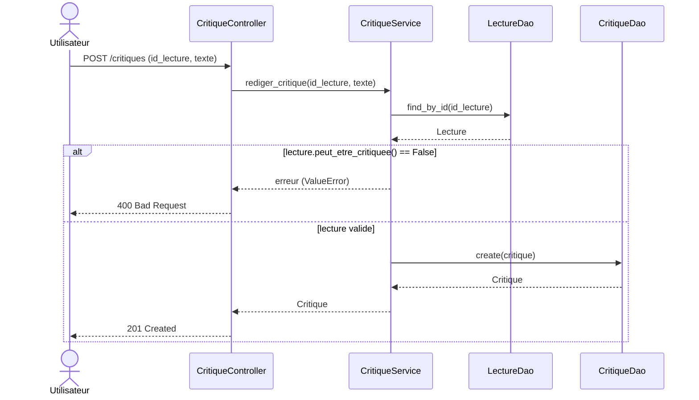

```mermaid
sequenceDiagram
    actor U as Utilisateur
    participant Ctrl as CritiqueController
    participant Svc as CritiqueService
    participant LDao as LectureDao
    participant CDao as CritiqueDao

    U->>Ctrl: POST /critiques (id_lecture, texte)
    Ctrl->>Svc: rediger_critique(id_lecture, texte)
    Svc->>LDao: find_by_id(id_lecture)
    LDao-->>Svc: Lecture
    alt lecture.peut_etre_critiquee() == False
        Svc-->>Ctrl: erreur (ValueError)
        Ctrl-->>U: 400 Bad Request
    else lecture valide
        Svc->>CDao: create(critique)
        CDao-->>Svc: Critique
        Svc-->>Ctrl: Critique
        Ctrl-->>U: 201 Created
    end
```